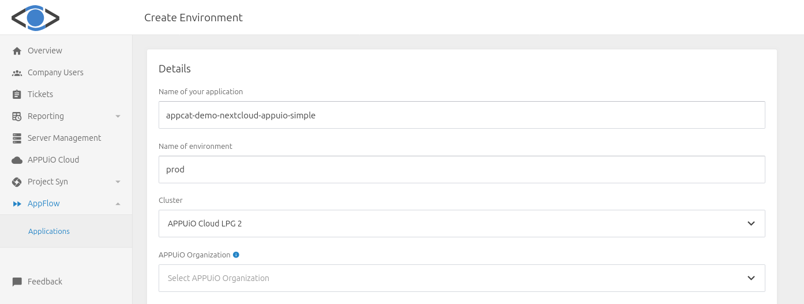
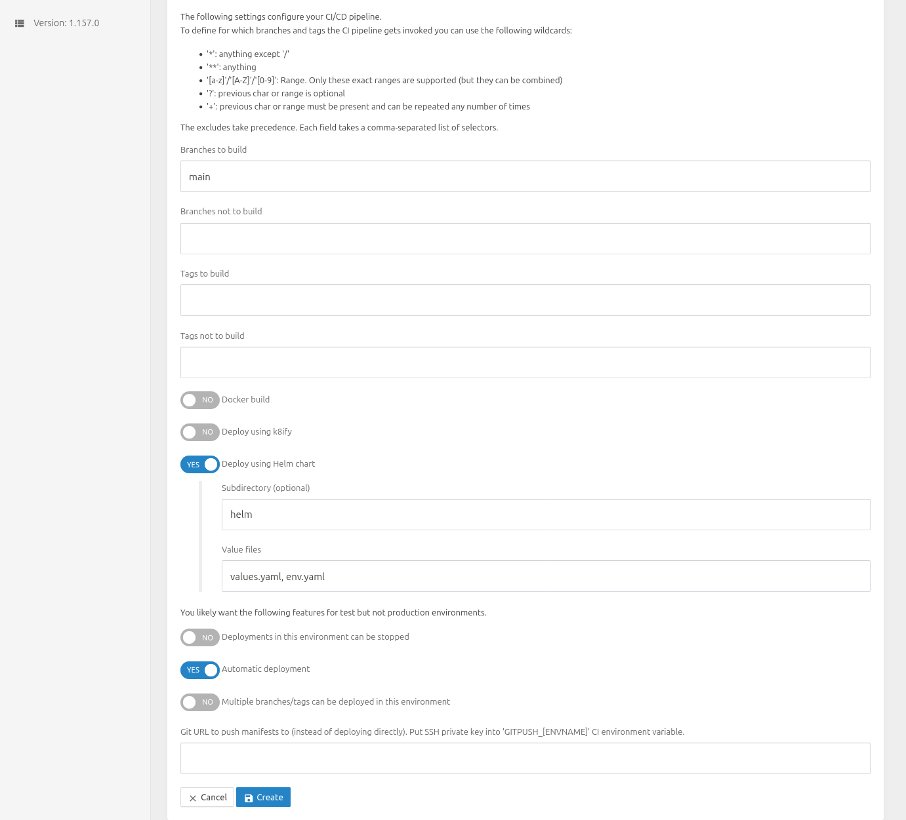
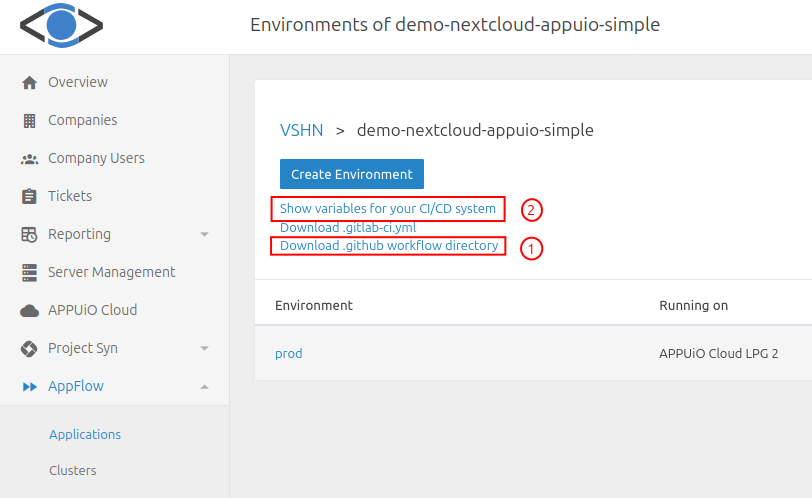

# Deploy [VSHNNextcloud](https://products.vshn.ch/appcat/nextcloud.html) to [APPUiO](https://www.appuio.ch)

This tutorial explains how to run [Nextcloud](https://nextcloud.com/)
with [VSHNNextcloud](https://products.vshn.ch/appcat/nextcloud.html) on APPUiO using the pipeline from [Appflow](https://github.com/vshn/appflow-demo).

## Requirements

- Access to APPUiO
- A [GitHub](https://github.com) account

## Add the [VSHN Application Catalog](https://products.vshn.ch/appcat/index.html) claim

To provision Nextcloud, we need a [VSHNNextcloud](https://products.vshn.ch/appcat/nextcloud.html) claim.
The documentation for VSHNNextcloud can be found here: [Nextcloud by VSHN](https://docs.appcat.ch/vshn-managed/nextcloud/index.html).
We start with a very simple setup:

**VSHNNextcloud**

```yaml
apiVersion: vshn.appcat.vshn.io/v1
kind: VSHNNextcloud
metadata:
  name: appcat-demo-nextcloud-appuio-simple # <1>
  namespace: vshn2-demo-nextcloud-appuio-simple-prod # <2>
spec:
  parameters:
    service:
      fqdn:
        - appuio-nextcloud-demo.apps.cloudscale-lpg-2.appuio.cloud # <3>
      version: "32" # <4>
    size: # <5>
      plan: standard-2
  writeConnectionSecretToRef:
    name: nextcloud-creds # <6>
```

1. Instance name
2. The namespace where the object will be created
3. Your fully qualified domain name.
   You should be able to change the DNS record for this domain.
4. Nextcloud version
5. Size of the Nextcloud instance.
   See [Plans and Sizing](https://docs.appcat.ch/vshn-managed/nextcloud/plans.html)
   for more information.
6. Secret where the connection details are provisioned.
   No secret with this name should exist in this namespace before creation.

## Put the claim under version control

To keep track of what's deployed, we put this claim into our Git repository.
For that, you need to create
a [new Git repository](https://github.com/new) on GitHub.
Now, we store the claim from before under `helm/templates/nextcloud.yaml`.
You can see the result in the
[helm/templates](./helm/templates).
We also need some boilerplate for Helm;
you can also find this in the
[helm](./helm).

## Deploy the claim

If you are a VSHN customer, you can generate the pipeline to deploy Nextcloud in [AppFlow](#create-an-application-and-environment-with-AppFlow).

Otherwise, you can copy the `.github/workflows` directory from the
[.github](.github)
and adapt it where needed.
For the pipeline to work, you need to add a kubeconfig to your pipeline.
First, you need to make sure you have the `oc` utility.
You can download it from the
[OpenShift console command line tools](https://console.cloudscale-lpg-2.appuio.cloud/command-line-tools).

**Generate kubeconfig for pipeline**

```bash
KUBECONFIG=./config-for-pipeline
oc login --web --server https://api.${zone}.cloud:6443
cat $KUBECONFIG
```

You can find the exact URL of your chosen zone in the
[APPUiO Portal](https://portal.appuio.cloud/zones).

This token is only valid for a short time.
To create a kubeconfig with a longer lifetime you can either use
[AppFlow](#appflow-helm)
or follow the
[DevOps and CI/CD docs for github](https://docs.appuio.cloud/user/how-to/use-github-actions.html#_4_configure_secrets).

Now you need to add this kubeconfig to the GitHub **secrets**. You find them under `Settings → Environments → choose environment → (+) Add secret`. In this case, the environment name is `prod`.
The kubeconfig must be stored as secret with the name `KUBECONFIG_PROD`.

We now have the pipeline and a minimal claim. But there are some steps missing.

## Best Practices

To follow best practices for your Nextcloud deployment, you need to configure the following settings:

**VSHNNextcloud: best practice**

```yaml
apiVersion: vshn.appcat.vshn.io/v1
kind: VSHNNextcloud
metadata:
  name: appcat-demo-nextcloud-appuio-simple
  namespace: vshn2-demo-nextcloud-appuio-simple-prod
spec:
  parameters:
    backup:
      retention:
        keepDaily: 6 # <1>
    instances: 1 # <2>
    maintenance: # <3>
      dayOfWeek: wednesday
      timeOfDay: "23:42:18"
    monitoring:
      email: your@email.com # <4>
    service:
      fqdn:
        - appuio-nextcloud-demo.apps.cloudscale-lpg-2.appuio.cloud
      version: "32"
      postgreSQLParameters:
        encryption:
          enabled: true
        service:
          majorVersion: "17" # <5>
        monitoring:
          email: your@email.com # <6>
        instances: 1 # <7>
    size:
      plan: standard-2
      disk: 16Gi # <8>
  writeConnectionSecretToRef:
    name: nextcloud-creds
```

1. The number of daily backups to keep.
2. Set to a value greater than 1 if you want to run Nextcloud with High Availability and update it without downtime.
3. When the maintenance job should run.
4. The email address where user alerts for Nextcloud should be sent.
5. The major version for the PostgreSQL instance. Start with the most recent major version.
6. The email address where user alerts for the PostgreSQL instance are sent.
7. Set to a value greater than 1 if you want to run PostgreSQL with High Availability and update it without downtime.
8. The desired disk space for your Nextcloud instance. This can only be increased later.

After you have configured all these settings, you can deploy your Nextcloud.
You will find the credentials to log in to your Nextcloud in the secret you specified previously.
It takes a while until the VSHNNextcloud is ready
and it may take even longer until the secret with the credentials is available.
You can retrieve this secret using the OpenShift console under
[Workloads > Secret](https://console.cloudscale-lpg-2.appuio.cloud/k8s/all-namespaces/core%7Ev1%7ESecret)
(Here for cloudscale).
If you used the provided link, you will need to choose the correct project in the dropdown menu.

## Create an application and environment with AppFlow

Navigate to [AppFlow](https://control.vshn.net/appflow/apps) on the [VSHN Portal](https://control.vshn.net/) and click on `Create App with Environment`.

**AppFlow: Create App**

* Name of your application: The name of your application.
This will be the first part of the namespace name that will be created.
* Name of environment: The name of the environment.
This will be the second part of the namespace name that will be created.
* Cluster: The cluster you want to deploy to.
* APPUiO Organization: The APPUiO Organization you want to use for
the deployment.


Important settings here are:

* Branches to build: Deploy only the main branch. We'll keep it simple
and deploy only the main branch to the single prod environment.
* Deploy using helm-chart: We use a Helm chart to deploy the resources.
To allow for other files in the repository,
the Helm chart is located in the `helm` directory.
* Automatic deployment: A push to the main branch should trigger the deployment of changes.

You should then see the created application with its environment, in this case, `prod`.

**AppFlow: Download pipeline and CI variables**

1. Download GitHub workflow
2. Show CI variables
